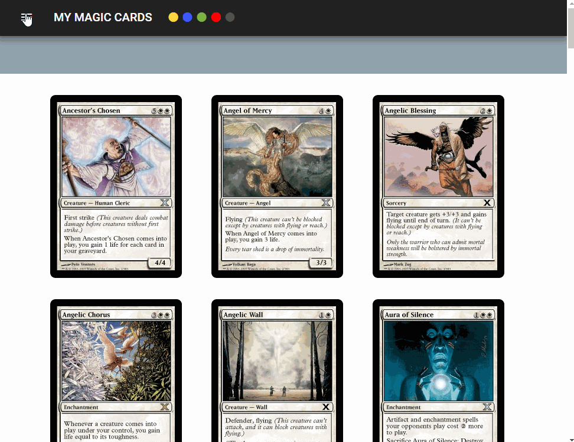

# My magic Angular
first project with Angular. It's an app with a MAGIC THE GATHERING API service, 
you can browse all cards by type. 
I used Visual Studio Code as IDE, Material design (with icons) and FlexLayout for... the layout. 

[Git page link](https://socalloff.github.io/My-Magic-Angular/www/)

